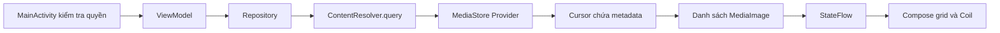

# Kiến thức Android Basic được áp dụng trong MiniGalleryCompose

Tài liệu này đối chiếu MiniGalleryCompose với bài giảng `docs/android_basic_components.md` của dự án AndroidTrainingExample, đặc biệt phần **5 — Content Provider** và **Bài 5 — Gallery và thêm ảnh**.

MiniGalleryCompose hiện áp dụng chủ yếu Activity Lifecycle và phần đọc dữ liệu qua Content Provider. Nút **Thêm ảnh → chọn ảnh → Add** hiển thị ảnh trực tiếp từ URI nguồn; không tạo bản sao hoặc ghi ảnh mới vào MediaStore.

## 1. Bảng đối chiếu kiến thức

| Nội dung trong bài giảng | Mức áp dụng | Cách triển khai trong project |
|---|---|---|
| 1 — Tổng quan các component | Có Activity và truy cập provider có sẵn | `MainActivity` hiển thị UI; repository truy cập MediaStore qua `ContentResolver`. |
| 2.1 — Activity Lifecycle | Có | `onCreate()` dựng Compose UI; `onResume()` kiểm tra lại quyền và tải lại thư viện. |
| 2.2–2.3 — Task, Back Stack, LaunchMode, Intent Flags | Chưa có bài thực hành riêng | App có một Activity, không tự điều hướng giữa nhiều Activity hoặc cấu hình launch flags. |
| 2.4 — Localization | Dùng string resources ở mức cơ bản | UI dùng `stringResource()`; chưa có chức năng chuyển ngôn ngữ hoặc bản dịch theo locale. |
| 3 — Service, AIDL, notification, PendingIntent | Chưa triển khai chức năng tương ứng | Không có started/bound/foreground Service, AIDL hoặc notification của app. |
| 4 — BroadcastReceiver | Chưa triển khai | Theo dõi ảnh bằng `ContentObserver`, không dùng BroadcastReceiver. |
| 5.1 — Content Provider, ContentResolver, Content URI | Có | App là client của provider hệ thống và các provider trả URI từ Photo Picker. |
| 5.2.1–5.2.2 — Quyền đọc ảnh | Có | Xin quyền theo phiên bản Android; xử lý FULL/PARTIAL/DENIED. |
| 5.2.3 — Query MediaStore | Có | Đọc metadata qua `query()`, duyệt Cursor, tạo URI; thực hiện trên `Dispatchers.IO`. |
| 5.2.4 — Hiển thị ảnh từ Content URI | Có | Coil `AsyncImage` tải URI vào `LazyVerticalGrid`. |
| 5.2.5 — Photo Picker | Có | Chọn tối đa 10 ảnh mỗi lượt bằng Activity Result API. |
| 5.3 — Ghi/thêm ảnh qua Content Provider | Hiện không áp dụng | Không có `insert()`, `openOutputStream()`, cập nhật publish hoặc xóa ảnh. |
| 5.4 — Custom Content Provider | Chưa triển khai | Không tự viết class kế thừa `ContentProvider` hoặc provider cho dữ liệu riêng. |

Khai báo `<service>` tên `com.google.android.gms.metadata.ModuleDependencies` trong Manifest là metadata hỗ trợ cài module Photo Picker trên thiết bị phù hợp. Nó có `enabled="false"`, không phải bài thực hành Service xử lý tác vụ của app.

## 2. Vai trò của Content Provider trong project

App sử dụng provider có sẵn, thông qua `ContentResolver`. App không cần tự tạo một class kế thừa `ContentProvider` để đọc thư viện ảnh của Android.

| Thành phần | Vai trò |
|---|---|
| MediaStore/provider hệ thống | Quản lý dữ liệu media và kiểm soát quyền truy cập. |
| `ContentResolver` | Đầu mối client dùng để gửi yêu cầu query hoặc mở nội dung theo URI. |
| Content URI | Định danh collection hoặc một ảnh cụ thể mà app muốn truy cập. |
| `Cursor` | Kết quả truy vấn gồm các dòng và cột metadata. |
| `MediaImage` | Model Kotlin mà repository tạo từ metadata. |
| Coil | Tải nội dung ảnh từ URI để hiển thị. |

Luồng đọc thư viện:



Xem [MainActivity.kt](../app/src/main/java/com/example/androidtrainingexample/MainActivity.kt) và [MediaStoreRepositoryImpl.kt](../app/src/main/java/com/example/androidtrainingexample/minigallery/data/MediaStoreRepositoryImpl.kt).

## 3. Query metadata ảnh — mục 5.2.3

`MediaStoreRepositoryImpl.queryImages()` chạy trong `withContext(Dispatchers.IO)` và gọi:

```kotlin
contentResolver.query(
    MediaStore.Images.Media.EXTERNAL_CONTENT_URI,
    projection,
    "${MediaStore.Images.Media.IS_PENDING} = 0",
    null,
    sortOrder
)?.use { cursor ->
    // Đọc từng dòng và chuyển thành MediaImage.
}
```

| Tham số | Ý nghĩa trong code |
|---|---|
| `uri` | Collection ảnh cần truy vấn. |
| `projection` | Các cột cần lấy: `_ID`, `DISPLAY_NAME`, `MIME_TYPE`, `SIZE`, `DATE_ADDED`. |
| `selection` | `IS_PENDING = 0`: chỉ lấy ảnh đã hoàn tất xuất bản. |
| `selectionArgs` | `null` vì điều kiện hiện tại không có placeholder `?`. |
| `sortOrder` | `DATE_ADDED DESC`: ảnh mới trước. |

Các kiến thức thực hành:

- `query()` lấy metadata; không trả bitmap hoặc toàn bộ bytes ảnh.
- `cursor.moveToNext()` duyệt từng dòng kết quả.
- `getColumnIndexOrThrow()` xác định vị trí cột; `getLong()`/`getString()` đọc giá trị.
- `use` đóng Cursor sau khi xử lý, kể cả khi xảy ra lỗi.
- `Dispatchers.IO` đưa việc query ra khỏi main thread để UI tiếp tục phản hồi.
- `ensureActive()` hỗ trợ dừng vòng lặp khi coroutine bị hủy.
- Lỗi quyền/I/O được chuyển lên ViewModel để báo lỗi, thay vì coi là thư viện trống.

`IS_PENDING` ở đây chỉ được dùng làm điều kiện **đọc**. Project không triển khai quy trình ghi ảnh với `IS_PENDING = 1`, ghi bytes rồi publish bằng `IS_PENDING = 0`.

## 4. Content URI và hiển thị ảnh — mục 5.1 và 5.2.4

Sau khi đọc `_ID`, repository tạo URI của một ảnh bằng:

```kotlin
val itemUri = ContentUris.withAppendedId(
    MediaStore.Images.Media.EXTERNAL_CONTENT_URI,
    id
)
```

Ví dụ URI:

```text
content://media/external/images/media/123
```

| Phần | Ý nghĩa |
|---|---|
| `content` | Scheme dùng để truy cập nội dung qua provider. |
| `media` | Authority xác định provider. |
| `external/images/media` | Path xác định collection ảnh. |
| `123` | ID của một ảnh cụ thể trong collection. |

App giữ URI, không chuyển URI thành đường dẫn file bằng cột `_data`. Việc truy cập phụ thuộc quyền đọc collection hoặc quyền cấp cho URI cụ thể.

Trong [MiniGalleryScreen.kt](../app/src/main/java/com/example/androidtrainingexample/minigallery/ui/MiniGalleryScreen.kt), ảnh được tải trực tiếp:

```kotlin
AsyncImage(
    model = uri,
    // Các tham số hiển thị khác.
)
```

`LazyVerticalGrid` với `GridCells.Fixed(3)` thay cho RecyclerView grid trong bài giảng. Key của item là chuỗi URI. UI dùng Compose nhưng kiến thức truy cập dữ liệu qua Content Provider vẫn giữ nguyên.

## 5. Quyền đọc thư viện — mục 5.2.1 và 5.2.2

Xem [AndroidManifest.xml](../app/src/main/AndroidManifest.xml), [PermissionHelper.kt](../app/src/main/java/com/example/androidtrainingexample/minigallery/util/PermissionHelper.kt) và [PermissionState.kt](../app/src/main/java/com/example/androidtrainingexample/minigallery/model/PermissionState.kt).

| Phiên bản được app hỗ trợ | Quyền |
|---|---|
| Android 10–12, API 29–32 | `READ_EXTERNAL_STORAGE`; Manifest giới hạn `maxSdkVersion="32"`. |
| Android 13, API 33 | `READ_MEDIA_IMAGES`. |
| Android 14+, API 34+ | Xin `READ_MEDIA_IMAGES` và `READ_MEDIA_VISUAL_USER_SELECTED` cùng lượt. |

App dùng `RequestMultiplePermissions()` và kiểm tra lại quyền thực tế qua `ContextCompat.checkSelfPermission()` trong callback.

| Trạng thái | Hành vi |
|---|---|
| `GrantedFull` | Bắt đầu quan sát và query thư viện theo quyền được cấp. |
| `GrantedPartial` | Query tập ảnh được hệ thống cho phép; hiển thị thông tin quyền một phần và nút quản lý/chọn thêm. |
| `Denied` | Hủy observer job, bỏ danh sách ảnh lấy từ thư viện; vẫn giữ các lựa chọn Photo Picker đang có trong ViewModel. |

Quyền một phần không được coi là lỗi hoặc thư viện bị từ chối hoàn toàn. MediaStore giới hạn kết quả theo quyền mà app đang có.

`MainActivity.onResume()` kiểm tra lại quyền khi quay về app, ví dụ sau khi người dùng đổi quyền trong Settings hoặc chọn lại tập ảnh được phép truy cập. Trạng thái quyền không được lưu vĩnh viễn thành boolean trong preferences.

## 6. Luồng Thêm ảnh → chọn ảnh → Add — mục 5.2.5

`MainActivity` đăng ký:

```kotlin
private val photoPickerLauncher = registerForActivityResult(
    ActivityResultContracts.PickMultipleVisualMedia(10)
) { uris -> viewModel.onPhotosSelected(uris) }
```

Launcher được mở với `PickVisualMedia.ImageOnly`. Luồng xử lý kết quả:

```text
Photo Picker trả List<Uri>
→ MiniGalleryViewModel.onPhotosSelected()
→ repository.getMediaInfo(uri)
→ thêm vào pickedImages
→ publishImages()
→ cập nhật StateFlow
→ Compose hiển thị ảnh
```

`getMediaInfo(uri)` thực hiện trên `Dispatchers.IO`:

1. Mở rồi đóng `openInputStream(uri)` để kiểm tra khả năng truy cập nguồn. Bước này không sao chép ảnh và không đọc toàn bộ nội dung.
2. Query tên và dung lượng bằng `OpenableColumns.DISPLAY_NAME`/`SIZE` nếu provider cung cấp.
3. Lấy MIME qua `contentResolver.getType(uri)`.
4. Trả `MediaImage` chứa nguyên URI nguồn.

Không giả định URI từ picker luôn là URI MediaStore có ID dùng được. Model của ảnh picker đặt `id = 0`; việc ghép danh sách và key UI dùng URI. Ngày của ảnh picker trong model hiện là thời điểm chọn, không phải ngày chụp ảnh gốc.

Trong [MiniGalleryViewModel.kt](../app/src/main/java/com/example/androidtrainingexample/minigallery/ui/MiniGalleryViewModel.kt), mỗi ảnh đọc thành công được đưa lên UI ngay. ViewModel ghép:

```kotlin
val images = (pickedImages + deviceImages)
    .distinctBy { it.uri.toString() }
```

Việc loại trùng dựa trên **chuỗi URI giống nhau**, không so sánh nội dung file để phát hiện cùng một ảnh qua các URI khác nhau.

Photo Picker cấp quyền đọc URI đã chọn mà không yêu cầu quyền toàn thư viện. Cơ chế này khác với chế độ PARTIAL của gallery riêng trên Android 14+: PARTIAL ảnh hưởng tập kết quả query MediaStore, còn picker cung cấp URI cụ thể cho app.

Danh sách `pickedImages` hiện được giữ trong ViewModel, chưa lưu qua process restart. Project chưa gọi `takePersistableUriPermission()`. Nếu mở rộng sang sử dụng URI lâu dài, cần thiết kế việc lưu URI, giữ quyền khi URI hỗ trợ và xử lý trường hợp nguồn hết quyền hoặc bị xóa.

## 7. ContentObserver và Flow

`MediaStoreRepositoryImpl.observeImages()` đăng ký `ContentObserver` trên collection ảnh để nhận thông báo thay đổi và query lại.

| API | Vai trò trong project |
|---|---|
| `registerContentObserver()` | Theo dõi thay đổi dữ liệu ảnh của MediaStore. |
| `callbackFlow` | Chuyển callback của observer thành luồng tín hiệu. |
| `trySend(Unit)` | Phát tín hiệu tải lần đầu hoặc khi có thay đổi. |
| `conflate()` và `debounce(300)` | Hạn chế xử lý các tín hiệu dồn dập. |
| `map { queryImages() }` | Chuyển tín hiệu thành danh sách ảnh mới. |
| `awaitClose` | Gọi `unregisterContentObserver()` khi Flow bị đóng/hủy. |
| `viewModelScope` | Quản lý coroutine và việc hủy khi ViewModel kết thúc. |
| `StateFlow` | Cung cấp trạng thái màn hình cho UI. |
| `collectAsStateWithLifecycle()` | Thu thập trạng thái cho Compose theo lifecycle. |

`ContentObserver` không phải BroadcastReceiver. Việc có observer không chứng minh app đã thực hành mục 4 của bài giảng.

`collectAsStateWithLifecycle()` quản lý việc UI thu thập StateFlow; observer repository được quản lý riêng bởi job trong ViewModel. Không nên suy luận chỉ từ API collect của UI rằng observer chắc chắn dừng mỗi khi Activity vào background.

## 8. Activity Lifecycle và Compose

Trong `MainActivity`:

- `onCreate()` gọi `setContent` để dựng UI.
- `onResume()` kiểm tra lại quyền và yêu cầu ViewModel refresh dữ liệu.
- Activity Result API nhận kết quả xin quyền và chọn ảnh.
- `ViewModel` giữ trạng thái khi Activity được tạo lại do configuration change.
- `rememberSaveable` giữ URI ảnh đang mở trong dialog chi tiết khi state được khôi phục.

Kiến thức bổ sung ngoài trọng tâm bốn component gồm: Compose, Material 3, state hoisting, ViewModel/Repository, StateFlow, coroutine, Coil, tìm kiếm/sắp xếp và kiểm thử. Những phần này hỗ trợ triển khai bài Gallery bằng giao diện Compose.

## 9. Đối chiếu tiêu chí Bài 5

Bài 5 trong tài liệu gốc yêu cầu thực hành cả **query metadata** và **ghi bytes qua ContentResolver**. Tiêu chí nêu code có cả `query()` và `insert()`/`openOutputStream()`; chỉ dùng Photo Picker là chưa đủ để chứng minh đã biết query MediaStore.

| Hạng mục | Trạng thái của project hiện tại |
|---|---|
| Tự query metadata qua MediaStore | Có. |
| Đọc Cursor trên IO và đóng Cursor | Có. |
| Xử lý FULL/PARTIAL/DENIED | Có. |
| Kiểm tra quyền và refresh khi quay lại app | Có. |
| Hiển thị Content URI bằng Coil | Có. |
| So sánh gallery permission với URI grant của picker | Có hai luồng riêng trong code. |
| Tạo bitmap và ghi ảnh bằng `insert()`/`openOutputStream()` | Chưa có trong phiên bản hiện tại. |
| Publish ảnh bằng `IS_PENDING` và dọn entry khi ghi thất bại | Chưa có. |
| Chụp ảnh bằng `TakePicture()` và dọn entry khi hủy | Chưa có. |
| Xóa ảnh, xin xác nhận với ảnh app khác | Chưa có; đây là phần mở rộng. |
| Tự tạo Custom ContentProvider | Chưa có; đây là phần mở rộng. |

Sau yêu cầu bỏ lưu bản sao, project vẫn thực hành phần **đọc Content Provider**, nhưng chưa hoàn thành toàn bộ phần **ghi ảnh** của Bài 5. Nút “Thêm ảnh” hiện thêm nguồn ảnh đã chọn vào danh sách hiển thị trong app, không tạo ảnh mới trong thư viện hệ thống.

## 10. Tài liệu tham khảo

- Bài giảng gốc: `docs/android_basic_components.md` trong dự án AndroidTrainingExample; đối chiếu mục 2.1, 5.1–5.4 và Bài 5. File này thuộc dự án gốc, không nằm trong repository MiniGalleryCompose.
- [Content provider basics — Android Developers](https://developer.android.com/guide/topics/providers/content-provider-basics).
- [Shared media / MediaStore — Android Developers](https://developer.android.com/training/data-storage/shared/media).
- [Selected Photos Access — Android Developers](https://developer.android.com/about/versions/14/changes/partial-photo-video-access).
- [Photo Picker — Android Developers](https://developer.android.com/training/data-storage/shared/photo-picker).
- [Giải thích code của project](CODE_WALKTHROUGH_VI.md).
- [Hướng dẫn viết lại project](REBUILD_GUIDE_VI.md).
