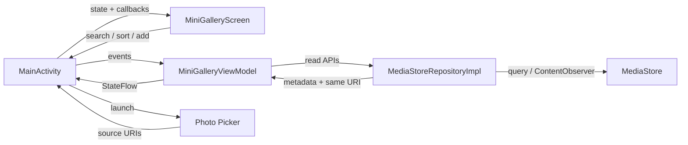
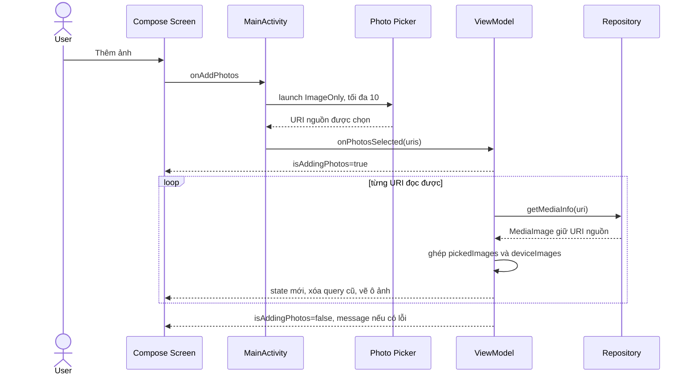

# Giải thích chi tiết mã nguồn MiniGalleryCompose

Đối chiếu với bản code ngày 05/10/2026. Luồng hiện tại: **Thêm ảnh → Photo Picker → hiển thị URI nguồn trong lưới ngay**. App không có hộp thoại xem trước nhập ảnh và không tạo bản sao vào Pictures/MiniGallery.

Đọc [hướng dẫn viết lại](REBUILD_GUIDE_VI.md) để thực hành theo thứ tự. [Phụ lục mã nguồn](SOURCE_REFERENCE_VI.md) chứa implementation đầy đủ để so sánh. Đường dẫn source bên dưới tính từ gốc dự án.

## 1. Chức năng và cấu trúc

Ứng dụng hiển thị ảnh từ hai nguồn: thư viện MediaStore mà người dùng cấp quyền và các URI do người dùng chọn trực tiếp bằng Photo Picker. Cả hai nguồn dùng cùng lưới ba cột, tìm kiếm, sắp xếp và hộp thoại chi tiết metadata.

Hộp thoại chi tiết khi chạm một ô ảnh vẫn được giữ. Hộp thoại này khác với chức năng xem trước và xác nhận lưu đã được bỏ.

```text
MiniGalleryCompose/
├── settings.gradle.kts
├── build.gradle.kts
├── gradle.properties
├── gradle/libs.versions.toml
├── gradle/wrapper/
├── app/build.gradle.kts
├── app/src/main/
│   ├── AndroidManifest.xml
│   ├── res/                     strings, vector, launcher, theme cửa sổ, backup
│   └── java/com/example/androidtrainingexample/
│       ├── MainActivity.kt
│       └── minigallery/
│           ├── model/           MediaImage, PermissionState, SortOrder
│           ├── data/            MediaRepository, MediaStoreRepositoryImpl
│           ├── util/            PermissionHelper
│           └── ui/              UiState, ViewModel, Screen, theme/
├── app/src/test/                 test JVM
├── app/src/androidTest/          test thiết bị/emulator
├── docs/                        tài liệu và phụ lục source
└── outputs/                     APK, kết quả kiểm tra
```

Gốc source Kotlin là `app/src/main/java/com/example/androidtrainingexample`. Package `minigallery/...` được giải thích bên dưới thuộc gốc này. Không có Room, API mạng hay tài khoản đăng nhập trong luồng ứng dụng.

## 2. Cấu hình build

| Thông số | Giá trị dự án | Công dụng |
|---|---|---|
| Project name | MiniGalleryCompose | Tên Gradle project |
| namespace | com.example.androidtrainingexample | Namespace của R và source Android |
| applicationId | com.example.minigallerycompose | ID cài đặt, cho phép cài cùng bản XML |
| minSdk | 29 | Android 10 trở lên |
| compileSdk | 36, minor 1 | API dùng để biên dịch |
| targetSdk | 36 | Mức hành vi Android app hướng tới |
| JDK / Java target | 21 | Toolchain dự án |
| Gradle | 9.3.1 | Phiên bản wrapper |
| AGP | 9.1.1 | Android build plugin |
| Compose compiler | 2.2.10 | Plugin biên dịch Compose |
| Compose BOM | 2026.03.01 | Đồng bộ phiên bản thư viện Compose |
| Activity | 1.13.0 | Activity và launcher |
| Lifecycle | 2.8.7 | ViewModel và collection theo lifecycle |
| Coil Compose | 2.7.0 | Tải ảnh bằng URI |
| Coroutines | 1.8.1 | Flow, dispatcher, coroutine |

Đây là các phiên bản đang dùng, không phải yêu cầu cập nhật lên thư viện mới nhất. Version catalog nằm trong `gradle/libs.versions.toml`. Build gốc khai báo plugin `apply false`; module app áp dụng Android application và Kotlin Compose plugin.

```kotlin
plugins {
    alias(libs.plugins.android.application)
    alias(libs.plugins.kotlin.compose)
}

// Nằm trong android { ... }
buildFeatures { compose = true }
```

AGP 9 có Kotlin tích hợp; cấu hình này không thêm plugin `org.jetbrains.kotlin.android`. Compose BOM quản lý thư viện UI, còn compiler plugin dùng phiên bản riêng. Module thêm BOM cho cả implementation và androidTestImplementation.

`ui-tooling` và `ui-test-manifest` dùng ở debug. Alias AppCompat/Material View/ConstraintLayout cũ còn trong catalog nhưng module không khai báo sử dụng chúng; chúng không đồng nghĩa app còn giao diện View.

Namespace và applicationId khác nhau là có chủ đích. Khi đổi ID cài đặt không cần đổi package Kotlin. Nếu đổi namespace hoặc package, cần kiểm tra imports, R, Manifest và test.

## 3. Kiến trúc và luồng dữ liệu



| Thành phần | Nhiệm vụ |
|---|---|
| MainActivity | Android lifecycle, ViewModel factory, launcher, Toast, setContent |
| Screen | Vẽ state, phát callbacks, giữ menu và URI ảnh chi tiết |
| ViewModel | Ghép nguồn ảnh, search/sort, điều phối metadata, cập nhật UiState |
| Repository | Query MediaStore, observer, đọc nguồn picker bằng ContentResolver |
| Model | Kiểu dữ liệu ảnh, trạng thái quyền và thứ tự |

State đi xuống UI; sự kiện đi lên Activity/ViewModel. Composable không query kho ảnh trong quá trình dựng giao diện. Repository không quyết định nút nào hiện hoặc phát Toast.

## 4. Model

### 4.1. MediaImage

File: `minigallery/model/MediaImage.kt`.

| Thuộc tính | Ý nghĩa |
|---|---|
| id: Long | ID MediaStore cho ảnh thư viện; ảnh picker dùng 0 vì ID phụ thuộc provider |
| uri: Uri | Địa chỉ nguồn ảnh, là identity cho merge và key của grid |
| displayName: String | Tên hiển thị |
| mimeType: String | Ví dụ image/jpeg hoặc image/png |
| sizeBytes: Long | Kích thước byte nếu provider cung cấp |
| dateAddedSeconds: Long | Ngày thêm MediaStore, hoặc thời điểm app thêm ảnh picker vào danh sách |

Không dùng `id` làm key chung cho cả hai nguồn. URI picker không nhất thiết thuộc collection MediaStore mà app đang query. App giữ URI gốc để Coil đọc trực tiếp.

`formattedSize` chọn B/KB/MB/GB theo cơ số 1024, giới hạn chỉ số đơn vị, định dạng theo locale. Giá trị không dương hiển thị `0 B`.

`formattedDate` nhân giây với `1000L` để tạo Date và định dạng `dd/MM/yyyy HH:mm`. Ngày thêm không phải ngày chụp. App chưa đọc EXIF như GPS, hãng máy ảnh hoặc thông số chụp.

### 4.2. PermissionState

File: `minigallery/model/PermissionState.kt`.

Ba trạng thái là `Denied`, `GrantedFull`, `GrantedPartial(selectedCount)`. `selectedCount` là số ảnh MediaStore app biết khi có quyền một phần, không phải số lần bấm Thêm. Giá trị được ViewModel cập nhật bằng số ảnh từ repository sau khi query.

### 4.3. SortOrder

File: `minigallery/model/SortOrder.kt`.

| Enum | Cách sắp xếp |
|---|---|
| DATE_DESC | sortedByDescending theo dateAddedSeconds |
| DATE_ASC | sortedBy theo dateAddedSeconds |
| NAME_ASC | sortedBy theo tên lowercase(locale) |
| NAME_DESC | sortedByDescending theo tên lowercase(locale) |

Nhãn enum đang viết trực tiếp bằng tiếng Việt. Sort tên chưa dùng Collator; search chưa chuẩn hóa bỏ dấu.

## 5. MiniGalleryUiState

File: `minigallery/ui/MiniGalleryUiState.kt`.

| Trường | Mặc định | Vai trò |
|---|---|---|
| allImages | emptyList | Danh sách hợp nhất, đã loại trùng URI |
| displayedImages | emptyList | Kết quả search/sort |
| searchQuery | chuỗi rỗng | Nội dung TextField |
| sortOrder | DATE_DESC | Quy tắc sort và nhãn menu |
| isLoading | false | Đang query thư viện |
| permissionState | Denied | Banner và observer thư viện |
| isAddingPhotos | false | Đang đọc metadata nguồn được chọn |
| userMessage | null | Thông báo Activity hiển thị Toast |

`totalCount` và `displayedCount` là getter lấy kích thước hai danh sách. Không giữ biến count riêng dễ lệch với ảnh.

`isLoading` và `isAddingPhotos` được tách riêng để quá trình refresh thư viện không mở khóa nút Thêm trong khi ảnh picker còn đang xử lý. Không còn ImportItem, ImportStatus, selectedImportList hay isImporting.

ViewModel giữ MutableStateFlow private và công khai StateFlow chỉ đọc:

```kotlin
private val _uiState = MutableStateFlow(MiniGalleryUiState())
val uiState: StateFlow<MiniGalleryUiState> = _uiState.asStateFlow()
```

`_uiState.update { it.copy(...) }` tạo state mới. Không sửa một danh sách đã phát rồi trông chờ Compose tự biết thay đổi.

## 6. MainActivity

File: `MainActivity.kt`.

### 6.1. ViewModel và repository

Activity kế thừa ComponentActivity. `by viewModels { MiniGalleryViewModel.Factory(...) }` truyền repository qua constructor; repository nhận applicationContext và contentResolver của ứng dụng. Tham số context trong implementation hiện chưa được sử dụng trong các hàm.

ViewModel có thể sống qua recreation; không giữ một Activity hoặc Dialog trong ViewModel.

### 6.2. Activity Result API

`permissionLauncher` dùng RequestMultiplePermissions. Callback gọi `refreshPermission()` để kiểm tra quyền thực tế qua PermissionHelper.

`photoPickerLauncher` dùng PickMultipleVisualMedia(10). Callback đưa URI tới `viewModel.onPhotosSelected(uris)`. Không còn một callback xác nhận lưu hoặc mở dialog nhập ảnh.

Khi mở picker, Activity dùng PickVisualMediaRequest với ImageOnly. Launcher đăng ký ở thuộc tính Activity trước trạng thái STARTED, không đăng ký lặp lại mỗi lần người dùng bấm nút.

### 6.3. onCreate

`enableEdgeToEdge()` bật bố cục dưới system bars. `setContent` thay inflate layout XML. Bên trong MiniGalleryTheme:

```kotlin
val state by viewModel.uiState.collectAsStateWithLifecycle()
```

Sau đó MainActivity truyền state và bốn callbacks cho Screen: search, sort, request permission, add photos. Hai callback đầu gọi ViewModel; hai callback sau gọi launcher cần Activity.

### 6.4. Toast và onResume

`LaunchedEffect(state.userMessage)` hiển thị Toast khi có thông báo và gọi clearUserMessage để xóa. Tác dụng phụ không đặt trực tiếp trong thân hàm vẽ UI.

`onResume` kiểm tra lại quyền mỗi lần quay lại. Callback picker và việc resume có thể xảy ra gần nhau. ViewModel giữ riêng pickedImages, nên xử lý Denied hay một query thư viện mới không xóa ảnh picker vừa được thêm.

`collectAsStateWithLifecycle()` quản lý collection ở UI. Nó không tự dừng job repository trong viewModelScope khi Activity ra background; đó là job riêng được ViewModel quản lý.

## 7. PermissionHelper và Manifest

File: `minigallery/util/PermissionHelper.kt`.

| API chạy | Quyền runtime | Trạng thái |
|---|---|---|
| 29–32 | READ_EXTERNAL_STORAGE | Full hoặc Denied |
| 33 | READ_MEDIA_IMAGES | Full hoặc Denied |
| 34+ | READ_MEDIA_IMAGES + READ_MEDIA_VISUAL_USER_SELECTED | Full, Partial hoặc Denied |

Trên API 34+, quyền Full được kiểm tra trước Partial. `currentKnownImageCount` chỉ giúp điền count ban đầu, không dùng để suy luận có quyền.

Manifest khai báo READ_EXTERNAL_STORAGE với maxSdkVersion=32 và hai quyền mới. Không có WRITE_EXTERNAL_STORAGE. App hiện chỉ đọc nguồn; không có insert/update/delete hay mở output stream trong production repository.

Metadata service ModuleDependencies hỗ trợ Photo Picker backport khi thiết bị có module tương ứng. Picker có luồng quyền riêng; người dùng không cần cấp quyền đọc toàn bộ thư viện để chọn vài ảnh và hiển thị chúng trong app.

Banner Denied vẫn có thể hiện cùng các ảnh đã chọn. Banner nói về quyền truy cập thư viện rộng hơn, không nói rằng các URI người dùng đã chủ động chọn không thể đọc được.

## 8. MediaRepository

File: `minigallery/data/MediaRepository.kt`.

| Hàm | Kết quả | Mục đích |
|---|---|---|
| observeImages() | Flow<List<MediaImage>> | Quan sát thay đổi thư viện |
| queryImages() | List<MediaImage> | Query trực tiếp, dùng trong pipeline và test |
| getMediaInfo(uri) | MediaImage | Đọc thông tin và giữ nguyên URI picker |

Không còn API saveImageCopy. ViewModel chỉ cần ba hàm đọc. Fake repository giúp kiểm tra logic mà không cần thiết bị.

## 9. MediaStoreRepositoryImpl

File: `minigallery/data/MediaStoreRepositoryImpl.kt`.

### 9.1. observeImages

`callbackFlow` đăng ký ContentObserver với collection ảnh và notifyForDescendants=true. Callback onChange phát Unit; Unit chỉ là tín hiệu cần query lại, không chứa danh sách ảnh.

`trySend(Unit)` sau đăng ký tạo lần nạp đầu tiên. `awaitClose` unregister observer khi collector bị hủy/đóng.

Pipeline tiếp theo gồm `conflate()`, `debounce(300L)`, `map { queryImages() }`, `flowOn(Dispatchers.IO)`. Conflate giữ tín hiệu mới khi phía đọc chưa theo kịp; debounce giảm query dồn dập; map đổi tín hiệu thành dữ liệu. Observer nhận callback bằng Handler main looper, query thực hiện ở IO.

### 9.2. queryImages

Hàm chạy trong withContext(IO), projection gồm _ID, DISPLAY_NAME, MIME_TYPE, SIZE, DATE_ADDED. Selection dùng IS_PENDING=0 để đọc bản ghi hoàn tất; sort query mặc định DATE_ADDED DESC.

Cursor được đóng bằng use. Chỉ số cột được tìm trước vòng lặp; mỗi hàng kiểm tra ensureActive để phản hồi cancellation. URI tạo bằng ContentUris.withAppendedId với collection ảnh.

Không dùng cột _data hoặc đường dẫn file. Nếu query ném lỗi, lỗi được truyền lên ViewModel thay vì giả thành danh sách rỗng. Nếu query trả null, hàm trả list rỗng. Tên/MIME thiếu dùng fallback IMG_<id>.jpg và image/jpeg.

### 9.3. getMediaInfo

Đây là hàm chính cho luồng Thêm mới:

1. Chạy trong IO và kiểm tra ensureActive.
2. Mở input stream của URI rồi đóng ngay để kiểm tra nguồn còn đọc được.
3. Query OpenableColumns.DISPLAY_NAME và SIZE.
4. Dùng tên mặc định selected_photo.jpg và size=0 khi metadata tùy chọn không có.
5. Ném lại CancellationException/SecurityException; lỗi metadata thông thường có thể dùng fallback khi nguồn vẫn đọc được.
6. Lấy MIME qua getType, fallback image/jpeg.
7. Trả MediaImage với URI gốc, id=0 và thời điểm thêm vào danh sách.

App không decode/re-encode, resize hoặc đổi định dạng ảnh. Coil tải thumbnail từ cùng URI sau khi state được phát. Với provider đám mây, thời gian đọc nguồn phụ thuộc provider/kết nối; công việc này không chạy trên main thread.

Ngày thêm của ảnh picker được lấy từ System.currentTimeMillis()/1000, vì metadata OpenableColumns không cung cấp ngày thêm MediaStore. Đây là thời điểm app thêm ảnh vào danh sách, không phải ngày chụp gốc.
## 10. MiniGalleryViewModel — từng hàm

File: `minigallery/ui/MiniGalleryViewModel.kt`.

### 10.1. Hai nguồn ảnh được giữ riêng

```kotlin
private var deviceImages: List<MediaImage> = emptyList()
private var pickedImages: List<MediaImage> = emptyList()
```

`deviceImages` được thay mỗi khi flow MediaStore phát dữ liệu mới. `pickedImages` tích lũy những URI đã chọn và đọc được trong phiên ViewModel. Nếu chỉ đưa ảnh picker vào UiState mà không giữ nguồn riêng, query thư viện sau đó có thể ghi đè mất chúng.

### 10.2. updatePermissionState

Cập nhật permissionState. Full/Partial gọi startObservingMedia. Denied hủy observeJob, xóa riêng deviceImages, gọi publishImages để giữ pickedImages, rồi tắt isLoading.

Quyền đọc MediaStore và quyền đọc URI picker tách biệt. App không chủ động loại URI picker khi quyền thư viện bị thu hồi. Nếu quyền của chính URI không còn, Coil có thể hiện ảnh lỗi; trường hợp này cần cơ chế kiểm tra/reselection khi mở rộng app.

### 10.3. startObservingMedia

Hủy job cũ, tạo job mới, đợi job cũ join rồi collect observeImages. Cách này tránh observer chồng nhau khi quyền hoặc lifecycle refresh liên tục.

Mỗi emission thay deviceImages và gọi publishImages. Sau đó tắt loading và cập nhật selectedCount của Partial bằng số ảnh thư viện, không tính ảnh picker.

Lỗi đọc thư viện được chuyển thành userMessage; cancellation ném lại. Danh sách cũ không bị xóa trong nhánh lỗi này, chỉ nhánh Denied xóa nguồn thư viện khi trạng thái quyền được kiểm tra lại.

### 10.4. publishImages

```kotlin
val images = (pickedImages + deviceImages).distinctBy { it.uri.toString() }
```

Ảnh picker đứng trước trong bước hợp nhất. Nếu hai nguồn có cùng chuỗi URI, bản picker được giữ. Provider picker có thể trả URI khác URI MediaStore dù cùng nội dung; distinctBy chỉ loại trùng địa chỉ, không so sánh byte ảnh.

Hàm dùng query hiện tại hoặc đặt query rỗng khi clearSearch=true, rồi cập nhật allImages, searchQuery và displayedImages trong một state mới.

Sort được áp dụng sau merge. DATE_DESC mặc định thường đưa ảnh vừa chọn lên đầu nhờ timestamp thêm mới. Nếu người dùng đang sort tên hoặc ngày tăng dần, thứ tự đó vẫn được giữ; ảnh mới không bị cố định ở đầu bất chấp sort.

### 10.5. setSearchQuery, setSortOrder, applyFilterAndSort

Hai hàm public đổi state và tính lại displayedImages từ allImages. Không query MediaStore mỗi lần gõ hoặc đổi menu.

applyFilterAndSort trim chuỗi tìm kiếm, dùng contains(ignoreCase=true), rồi sortedBy/sortedByDescending. Từ khóa trong TextField vẫn giữ nguyên như người dùng gõ. Search chưa bỏ dấu. Danh sách được xử lý trong RAM, phù hợp dự án nhỏ; thư viện rất lớn cần cân nhắc paging và chuyển xử lý nặng ra khỏi main thread.

### 10.6. onPhotosSelected — thay cho luồng xác nhận lưu

Danh sách URI rỗng hoặc đang isAddingPhotos được bỏ qua. Cờ isAddingPhotos bật **trước khi launch coroutine**, tránh hai sự kiện liên tiếp tạo hai job trước khi job đầu được chạy.

Trong coroutine, app lấy tối đa 10 URI và loại URI lặp trong batch. Với từng URI:

```kotlin
val image = repository.getMediaInfo(uri)
pickedImages = (pickedImages + image).distinctBy { it.uri.toString() }
publishImages(clearSearch = true)
```

Ảnh được phát ngay sau khi metadata của ảnh đó đọc thành công; không đợi toàn batch xong để mở dialog. `clearSearch=true` loại một bộ lọc cũ có thể làm người dùng tưởng ảnh vừa thêm bị mất.

Một URI đọc lỗi không chặn các URI còn lại. App đếm lỗi và cuối batch phát thông báo số ảnh không đọc được. Nếu không lỗi nhưng đầu vào vượt 10, app thông báo giới hạn. `finally` tắt isAddingPhotos cả khi cancellation xảy ra.

Việc gọi onPhotosSelected không tạo output URI mới. Chọn lại cùng URI không thêm một ô trùng; chọn nhiều lần với URI khác sẽ bổ sung vào danh sách đang có.

### 10.7. clearUserMessage và Factory

clearUserMessage đặt message null sau Toast. Factory tạo MiniGalleryViewModel với repository được truyền vào; modelClass không phù hợp ném IllegalArgumentException. Dự án chưa cần framework dependency injection.

## 11. MiniGalleryScreen — từng composable

File: `minigallery/ui/MiniGalleryScreen.kt`.

### 11.1. Signature và state cục bộ

Screen nhận UiState và bốn callbacks. Dữ liệu thư viện do ViewModel giữ, nhưng Screen giữ trạng thái menu và URI ảnh đang xem:

```kotlin
var sortMenuExpanded by remember { mutableStateOf(false) }
var detailUri by rememberSaveable { mutableStateOf<String?>(null) }
val detailImage = state.allImages.firstOrNull { it.uri.toString() == detailUri }
```

remember giữ menu qua recomposition; rememberSaveable cho phép khôi phục chuỗi URI qua saved state của Activity. Dialog tìm ảnh trong allImages, không chỉ displayedImages.

Nếu URI không nằm trong allImages, dialog không được vẽ. Code không tự đặt detailUri=null trong nhánh này; URI có thể được tìm lại sau khi dữ liệu nạp lại. Nút Đóng chủ động đặt URI null.

### 11.2. Scaffold, TextField và sort menu

Scaffold có TopAppBar và nút Button đặt trong slot floatingActionButton. Nút Thêm chỉ bị khóa khi isAddingPhotos=true; người dùng có thể chọn ảnh dù quyền thư viện Denied.

Column nhận padding của Scaffold và consumeWindowInsets. Vùng lưới weight(1f) dùng phần chiều cao còn lại; grid có padding đáy 88dp để chừa vị trí nút.

TextField lấy value=state.searchQuery và onValueChange là callback. Bên ngoài phải cập nhật state rồi truyền lại, nếu không TextField sẽ không giữ giá trị nhập. Đây là điểm quan trọng khi viết UI test cho một màn hình điều khiển bằng state.

DropdownMenu duyệt SortOrder.entries. Bấm mục sẽ đóng menu và phát onSortOrderChange. Nhãn nút luôn lấy từ state.sortOrder.label.

### 11.3. LazyVerticalGrid và trạng thái rỗng/tải

GridCells.Fixed(3) tạo lưới ba cột. Key là URI.toString để ô ảnh có danh tính ổn định khi sort/recomposition. Thumbnail dùng aspectRatio(1f), tên một dòng có ellipsis; chạm Card ghi detailUri.

Nếu displayedImages rỗng và không có tác vụ đọc, Screen hiện thông báo trống hoặc tìm kiếm không có kết quả. Spinner hiện khi isLoading hoặc isAddingPhotos. Lưới đang có ảnh vẫn có thể hiện phía dưới spinner trong quá trình đọc thêm.

### 11.4. PermissionBanner

GrantedFull return sớm. Partial và Denied dùng Card chung với nội dung resource tương ứng. Nút gọi onRequestPermission. Icon trang trí không có contentDescription; text của banner đã mô tả thông tin.

### 11.5. Photo

AsyncImage của Coil nhận URI, description, Modifier và ContentScale. Crop mặc định cho thumbnail; Fit cho ảnh chi tiết. Placeholder và error dùng ic_image. Không mở stream hoặc decode bitmap trong thân composable.

Tên ảnh làm contentDescription của thumbnail trong lưới, hỗ trợ accessibility và tìm node trong UI test.

### 11.6. ImageDetailDialog và Metadata

Dialog có title, LazyColumn chứa ảnh xem lớn và các cặp nhãn/giá trị, cùng nút Đóng bên ngoài vùng cuộn. Hiển thị tên, MIME, dung lượng, ngày thêm và URI. Metadata bọc giá trị bằng SelectionContainer để người dùng sao chép.

Đây là thao tác xem chi tiết một ảnh đã có trong lưới. Nó không yêu cầu xác nhận nhập ảnh và không có nút lưu bản sao.

### 11.7. GalleryDialog và Preview

GalleryDialog dùng Compose Dialog, Surface bo góc, chiều cao tối đa 640dp, padding 20dp. Content có receiver ColumnScope để composable con dùng weight/align đúng scope.

Preview dùng UiState mặc định và callbacks rỗng. Preview kiểm tra bố cục; nó không mở Photo Picker hoặc query ảnh thiết bị.

## 12. Theme và tài nguyên

MiniGalleryTheme chọn lightColorScheme/darkColorScheme qua isSystemInDarkTheme, bọc UI bằng MaterialTheme. Dự án dùng bảng màu cố định, chưa dùng dynamic color theo wallpaper.

XML theme trong values/values-night quản lý cửa sổ Android; theme Compose quản lý composable. Chuyển Compose bỏ res/layout và ViewBinding, nhưng Manifest, strings, vector, launcher và cấu hình backup vẫn dùng resource Android.

Nhãn UI chính và metadata lấy từ strings.xml. Nhãn SortOrder và thông báo ViewModel còn viết trực tiếp bằng tiếng Việt. Khi hỗ trợ đa ngôn ngữ, cần chuyển cả những nhóm đó, không chỉ thêm một bản dịch strings.xml.

## 13. Luồng chọn ảnh thực tế



Trong luồng quyền: onResume/checkPermissionState → updatePermissionState → startObservingMedia khi được phép → queryImages → deviceImages → publishImages → UI. Khi Denied, chỉ deviceImages được xóa, pickedImages được giữ.

## 14. Lifecycle và phạm vi lưu trạng thái

| Thành phần | Qua recomposition | Qua xoay màn hình | Qua process death |
|---|---|---|---|
| Query, sort, nguồn picker trong ViewModel | Giữ | Giữ khi cùng ViewModel | Chưa lưu/khôi phục |
| URI ảnh chi tiết rememberSaveable | Giữ | Có thể khôi phục saved state | Phụ thuộc saved state hệ thống và dữ liệu ảnh nạp lại |
| Menu remember | Giữ | Reset | Reset |
| Job metadata viewModelScope | Tiếp tục | Tiếp tục khi ViewModel được giữ | Không tiếp tục |

Ảnh chọn thêm hiện được giữ trong phiên ViewModel, chưa lưu danh sách URI bền vững vào database/preferences và chưa gọi takePersistableUriPermission. Sau khi process bị dừng và khởi tạo mới, người dùng có thể cần chọn lại ảnh. Code không ghi bản sao để vượt qua giới hạn này.

Nếu cần danh sách ảnh chọn tồn tại sau khi mở lại app, cần thiết kế riêng việc lưu URI, quyền persistable khi provider cho phép, kiểm tra nguồn còn tồn tại và UI chọn lại nguồn mất quyền. Không đưa bitmap hoặc toàn bộ ảnh vào Bundle.

## 15. Test và kiểm chứng

| Nhóm | File | Nội dung |
|---|---|---|
| JVM | MiniGalleryViewModelTest | Thêm trực tiếp khi Denied, giới hạn 10, loại URI trùng, thêm nhiều lượt, giữ picker khi refresh/revoke, merge, clear search, sort, lỗi từng URI, cancellation |
| JVM | MediaStoreQueryTest | SecurityException query được truyền lên |
| JVM | MediaRepositoryBehaviorTest | Formatter MediaImage và nhãn SortOrder |
| Thiết bị | MiniGalleryScreenTest | Banner, callbacks, empty state, restore chi tiết, ảnh chọn trong lưới và không có dialog nhập, khóa nút lúc metadata |
| Thiết bị | MediaStoreRepositoryInstrumentedTest | Giữ URI nguồn, byte không đổi, không tạo bản ghi mới, nguồn đã xóa báo lỗi |

Test repository trên thiết bị tạo và dọn ảnh tạm thuộc app. Production app không có thao tác tạo ảnh; thao tác write trong file test chỉ là fixture để kiểm tra read path.

UI test đưa synthetic state vào Screen, không thay thế kiểm tra toàn bộ dialog quyền/picker của hệ thống. Fake callback search/sort phải cập nhật Compose state để mô phỏng ViewModel thật.

```powershell
.\gradlew.bat :app:assembleDebug :app:testDebugUnitTest :app:lintDebug
.\gradlew.bat :app:connectedDebugAndroidTest
```

Kết quả thực tế của lần build hiện tại nằm ở [VERIFICATION.md](../VERIFICATION.md). Test được chạy trên emulator Android 15; không suy ra đã kiểm tra runtime tất cả API 29–36 từ một thiết bị.

## 16. Nơi sửa khi mở rộng

| Mong muốn | Nơi thay đổi | Điều cần giữ |
|---|---|---|
| Giới hạn khác 10 | Launcher, take(10), string và test | Giới hạn UI và nghiệp vụ đồng nhất |
| Lưu URI qua lần mở lại | Repository/quyền + nơi lưu URI + ViewModel | Không tạo bản sao ngoài yêu cầu; xử lý URI mất quyền |
| Search không dấu | applyFilterAndSort | Giữ chuỗi nhập gốc, chuẩn hóa lúc so sánh |
| Sort kích thước | SortOrder + ViewModel + test | Mọi nhánh when phải cập nhật |
| Loại trùng cùng nội dung khác URI | Cơ chế identity riêng | Không giả định hai provider URI là cùng bản ghi |
| EXIF | Repository/model chi tiết | Đọc từ stream, xử lý trường thiếu |
| Thư viện lớn | Query/paging và xử lý danh sách | Giảm RAM và công việc nặng main thread |

## Tài liệu Android bổ sung

Các giải thích implementation phía trên dựa vào source dự án. Các tài liệu sau hỗ trợ hiểu khái niệm nền tảng:

- [State and Jetpack Compose](https://developer.android.com/develop/ui/compose/state): state và recomposition.
- [Access media files from shared storage](https://developer.android.com/training/data-storage/shared/media): URI, MediaStore và collection.
- [Grant partial access to photos and videos](https://developer.android.com/about/versions/14/changes/partial-photo-video-access): quyền một phần và chọn lại ảnh.